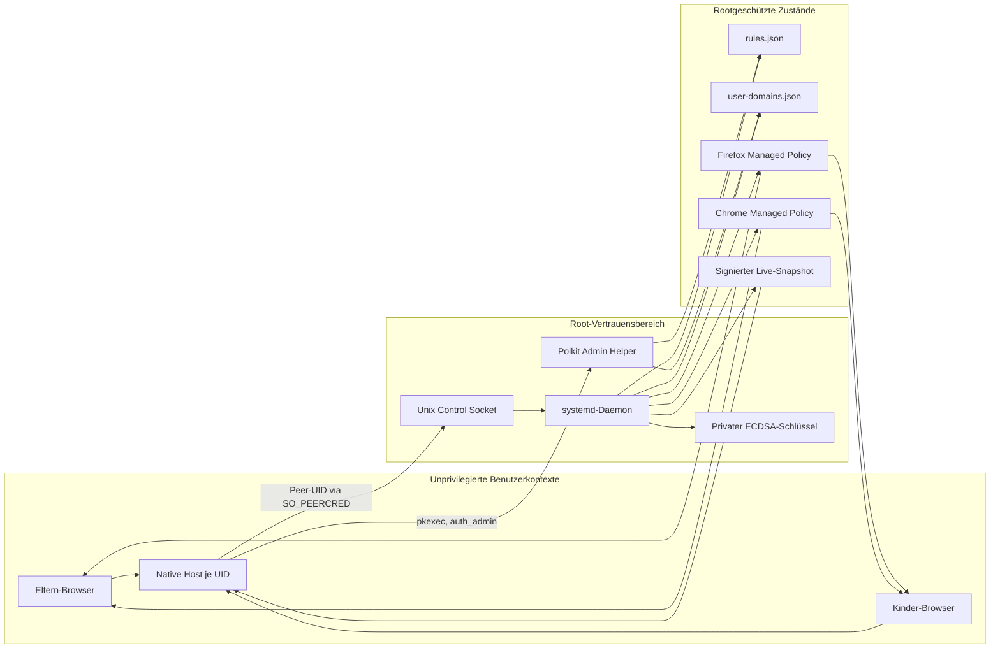

# Threat Model und Sicherheitsreview

Stand: 31. August 2026 · Projektversion 0.5.3

Dieses Dokument beschreibt die beabsichtigten Sicherheitsgarantien, die
Vertrauensgrenzen und die derzeit bekannten Restrisiken von Ubuntu Parental
Control. Es ist ein entwicklerinternes Review und ausdrücklich kein
unabhängiges Sicherheitsaudit.

## Schutzversprechen

Unter den unten genannten Annahmen soll ein eingeschränktes Linux-Konto:

- aktive Webfilter-Regeln weder löschen, lockern noch deaktivieren können,
- ausschließlich Domains zu vorhandenen Blockierlisten ergänzen können,
- keine Elternrolle oder abweichenden Live-Regelsnapshots vortäuschen können,
- keine unvalidierten Regeln in Firefox oder Chrome aktivieren können und
- bei einem Fehler des Livekanals nicht automatisch ungefiltert surfen können.

Zusätzlich sollen administrative Änderungen vollständig validiert, dauerhaft
gespeichert und in Firefox und Chrome nachvollziehbar veröffentlicht werden.
Append-only-Ergänzungen verschiedener Kinderkonten sollen getrennt und nur für
Root lesbar gespeichert werden.

## Annahmen und bewusste Grenzen

Das Modell setzt voraus, dass das Kinderkonto weder Root- noch `sudo`-Rechte
besitzt und nicht in eine andere Systeminstallation booten kann. Kernel,
systemd, Polkit, Browser, WebExtension-APIs und die Paketquellen des
Betriebssystems gelten als vertrauenswürdig.

Nicht abgedeckt sind insbesondere:

- ein Angreifer mit Rootrechten oder physischer Kontrolle über den Rechner,
- Netzwerkverkehr außerhalb der verwalteten Browser,
- andere Browser, eingebettete WebViews, VPNs, DNS-Tunnel oder native Apps,
- Sicherheitslücken im Betriebssystem oder in Firefox und Chrome sowie
- garantierte Verfügbarkeit bei absichtlicher lokaler Ressourcenerschöpfung.

Der Filter schützt damit eine lokale Browsernutzung, ist aber keine
Netzwerk-Firewall und keine vollständige Gerätekontrolle.

## Rollen und Vertrauensbereiche

- **Elternadministrator:** Darf sich über Polkit authentifizieren und die
  vollständigen Basisregeln verwalten.
- **Eingeschränktes Konto:** Darf nur die eigene UID-authentifizierte Operation
  `add_domain` für Blocks mit `action: block` verwenden.
- **Root-Daemon:** Validiert Basis- und Benutzerregeln, vereinigt beide Ebenen,
  veröffentlicht Managed Policies und signiert Live-Snapshots.
- **Native Host:** Läuft mit der Browser-UID und transportiert Nachrichten. Er
  ist kein Vertrauensanker.
- **WebExtension:** Erzwingt den geprüften Snapshot über DNR. Ihr statischer
  Regelsatz bildet den Fail-safe.
- **Remote Website:** Ist vollständig unvertrauenswürdig und darf keine lokale
  Verwaltungsoperation ohne ausdrückliche Benutzerinteraktion auslösen.
- **Sonstiges lokales Konto:** Erhält explizit die Rolle `unauthorized` und
  keinen Zugriff auf Eltern- oder Kinderoperationen.

## Datenfluss und Vertrauensgrenzen

Der öffentliche Schlüssel gelangt ausschließlich über die rootgeschützte
Managed Policy zur Extension. Der Native Host darf den Live-Snapshot lesen,
aber seine Signatur nicht selbst erzeugen. Die Identität einer Socket-Anfrage
wird nicht aus der Extensionnachricht, sondern aus `SO_PEERCRED` übernommen.

## Geschützte Zustände

- `/etc/ubuntu-parental-control/rules.json` enthält Basisregeln. Sie sind
  lesbar, aber nur administrativ schreibbar.
- `/var/lib/ubuntu-parental-control/user-domains.json` enthält UID-bezogene
  Kinderergänzungen und wird mit Modus `0600` gespeichert.
- `/var/lib/ubuntu-parental-control/live-signing-key.pem` ist der private
  P-256-Schlüssel und wird mit Modus `0600` gespeichert.
- `/run/ubuntu-parental-control/live-snapshot.json` darf öffentlich lesbar sein,
  weil Integrität und Authentizität kryptografisch geprüft werden.
- Die Firefox- und Chrome-Policy-Dateien sind der Start-Vertrauensanker der
  Extension und müssen in rootgeschützten Verzeichnissen liegen.

## Bestehende Kontrollen

### Autorisierung

- Der Root-Socket übernimmt die echte UID über `SO_PEERCRED`.
- Kinderbefehle sind auf `add_domain` begrenzt und prüfen Block-ID, Domain,
  Kontoregistrierung und `action: block` erneut im Daemon.
- Administratoränderungen verwenden einen festen Polkit-Helper mit
  `auth_admin` und vollständig geschlossenen Anfrageformaten.
- Eine signierte Statusantwort bindet Rolle, UID und eine frische Nonce an die
  aktuelle Browseranfrage.

### Integrität und Fail-safe

- Basis- und effektive Regeln durchlaufen denselben strikten Validator.
- Live-Snapshots tragen eine ECDSA-P-256-Signatur; der öffentliche Schlüssel
  kommt aus Managed Storage.
- SHA-256-Revisionen erkennen gemischte oder beschädigte Snapshots.
- Persistent monotone Snapshot-Generationen verhindern signierte Replay- und
  Rollback-Zustellungen gegenüber dem aktuellen Managed-Anker sowie innerhalb
  einer laufenden Browser-Sitzung.
- Ungültige Änderungen ersetzen weder den aktiven Daemonzustand noch die letzte
  gültige Sicherung.
- Die Extension entfernt bei Aktivierungsfehlern dynamische Regeln und schaltet
  den statischen Blockier-Regelsatz ein.

### Dateisystem

- Benutzerzustand, Versionshistorie und temporäre Schreibdateien verwenden
  restriktive Modi, `O_EXCL`, teilweise `O_NOFOLLOW`, `fsync()` und
  `os.replace()`.
- Die produktiven Elternverzeichnisse sind root-eigen. Dadurch kann ein
  Kinderkonto die noch vorhandenen Check-then-open-Sequenzen nicht zwischen
  Prüfung und Öffnen austauschen.
- Der systemd-Dienst verwendet unter anderem `ProtectSystem=strict`,
  `ProtectHome=true`, eine leere Capability-Menge und explizite
  `ReadWritePaths`.

### Ressourcenbegrenzung

- Native- und Socketnachrichten, Snapshots, Blocks und Matchlisten besitzen
  feste Größenlimits.
- Regex werden konservativ validiert und zusätzlich von der Browser-DNR-API
  geprüft.
- Nicht verlustfrei darstellbare Pattern-/Regex-Ausnahmen werden abgelehnt.

## Offene Risiken und Maßnahmen

### R-01: Elternrolle wird negativ bestimmt

**Priorität: hoch · Status: behoben in 0.5.3**

Vor 0.5.3 behandelte der Socket jedes Konto, das nicht in `restricted_users`
stand, als Elternkontext. Ein später angelegtes normales Nicht-Admin-Konto
konnte dadurch die Elternansicht und über `base_rules` auch alle Einträge aus
`user-domains.json` lesen. Administrative Änderungen blieben zwar durch
Polkit geschützt, aber Rollenanzeige und Vertraulichkeit waren zu weit gefasst.

Umgesetzt: Das Protokoll liefert `restricted`, `administrator` oder
`unauthorized`; Administratoren werden positiv über `administrator_users`
geprüft. Regressionen: `tests/test_user_rules.py`.

### R-02: Parallele Elternänderungen können sich überschreiben

**Priorität: hoch · Status: behoben in 0.5.3**

Schon vor 0.5.3 war jede einzelne Ersetzung von `rules.json` atomar. Zwei
gleichzeitig gestartete Editor-, CLI- oder Polkit-Operationen konnten aber
denselben alten Stand lesen und anschließend nacheinander gültige Dateien
schreiben. Die spätere Operation überschrieb dann unbemerkt die frühere
Änderung. Das war kein beschädigtes Teil-JSON, aber ein verlorenes Update.

Umgesetzt: CLI, Polkit-Helper und GUI verwenden eine gemeinsame
rootgeschützte `flock`-Sperre und prüfen die erwartete Basisrevision.
Regressionen einschließlich Thread-Konkurrenz: `tests/test_user_rules.py`,
`tests/test_upcctl.py`.

### R-03: Veröffentlichung an zwei Browser ist nicht transaktional

**Priorität: mittel · Status: behoben in 0.5.3**

Chrome und Firefox besitzen getrennte Policy-Dateien. Vor 0.5.3 konnten bei
einem Fehler der zweiten Ersetzung vorübergehend zwei unterschiedliche,
jeweils gültige Snapshots aktiv sein. Der Daemon übernahm den neuen Zustand in
diesem Fall zwar nicht als aktiv, rollte die bereits geschriebene Policy aber
nicht zurück.

Umgesetzt: Verwaltete Ziele werden gesichert; Fehler nach einzelnen
Publikationsschritten lösen best-effort Rollback aus. Regressionen:
`tests/test_managed_policy.py`, `tests/test_user_rules.py`.

### R-04: Lokale Verfügbarkeit des Control-Sockets

**Priorität: mittel · Status: behoben in 0.5.3**

Der Socket ist weiterhin mit Modus `0666` erreichbar, weil mehrere dynamisch
erkannte Kinderkonten ohne gemeinsame Gruppe darauf zugreifen müssen. Vor
0.5.3 bearbeitete der Server Verbindungen seriell und signierte
Statusantworten über einen OpenSSL-Unterprozess. Ein lokales Konto konnte
daher durch langsame Verbindungen Live-Updates und den Editor verzögern.
Bereits aktive DNR-Regeln und Managed Policies blieben dabei erhalten.

Umgesetzt: Parallele Worker, globale/per-UID-Limits, Timeouts sowie sichere
EOF-/Worker-Start-Bereinigung. Regressionen: `tests/test_user_rules.py`.

### R-05: Restliche Dateipfad-Races

**Priorität: niedrig · Status: beobachtet**

Einige Lesewege prüfen einen Pfad mit `is_symlink()` oder `stat()` und öffnen
ihn anschließend separat. In den produktiven root-eigenen Verzeichnissen kann
ein unprivilegiertes Konto den Pfad dazwischen nicht austauschen. Die aktuelle
Sicherheitsgrenze verhindert deshalb eine praktische Rechteausweitung durch das
Kinderkonto; die Implementierung ist aber nicht vollständig dirfd-basiert.

Geplante Maßnahme: Kritische Dateien nach Möglichkeit mit `O_NOFOLLOW` öffnen,
anschließend über `fstat()` Typ, Eigentümer und Modus prüfen und Operationen
relativ zu bereits geöffneten Elternverzeichnissen ausführen. Tests sollen
Symlink-, Eigentümer- und Austauschfälle abdecken.

### R-06: Lieferkette und unabhängige Prüfung

**Priorität: mittel · Status: teilweise behoben / Defense-in-depth**

Die CI-Actions sind auf verifizierte Commit-SHAs gepinnt und werden getestet.
Offen bleiben reproduzierbare Release-Nachweise, veröffentlichte Artefakt-Hashes
und unabhängige Sicherheitsprüfung. Der Installer prüft
Struktur, ID, Mindestversion und Berechtigungen des XPI, aber keinen separat
veröffentlichten Projekt-Hash. Browser-Store-Signaturen und HTTPS reduzieren
das Risiko, ersetzen jedoch kein überprüfbares Release-Verfahren.

Nächste Maßnahme: SHA-256-Prüfsummen, reproduzierbarer Buildprozess und
externes Review vor einer stabilen Version.

### R-07: Zusätzliche systemd-Härtung

**Priorität: niedrig · Status: Härtung**

Die Unit besitzt bereits starke grundlegende Einschränkungen. Weitere Optionen
wie `PrivateDevices`, `ProtectKernelTunables`, `ProtectKernelModules`,
`ProtectControlGroups`, `RestrictSUIDSGID` und ein enger Systemcall-Filter sind
noch nicht auf Kompatibilität mit Python, Unix-Sockets, OpenSSL und den
Policy-Schreibwegen getestet.

Geplante Maßnahme: Direktiven einzeln ergänzen und jeweils mit dem realen
Installer-, Daemon-, Firefox- und Chrome-Ablauf testen.

## Prüffälle für die Sicherheitsinvarianten

Der aktuelle Testbestand deckt bereits folgende Invarianten ab:

- `tests/test_user_rules.py`: Peer-UID, append-only Rechte, Rollenstatus,
  Signaturen, Sperrdatei und Polkit-Anfrageformat.
- `tests/test_upcctl.py`: atomare Ersetzung, Versionshistorie, Rollback,
  Symlink-Ablehnung und beschädigte Eingaben.
- `tests/test_managed_policy.py`: identische Snapshots, Größenlimit,
  Publikationsfehler und DNR-Einschränkungen.
- `tests/test_rule_engine.js`: Prioritäten, Fail-safe-nahe Kompilierung,
  Zeitfenster und browserneutrale Regelübersetzung.
- `tests/test_background_start.js` und `tests/test_native_live_update.js`:
  verzögerte Native-Verbindung, Snapshot-Aktivierung und Live-Updates.
- `tests/test-installer.sh`: installierte Modi, Policies, Native Manifeste,
  Dienstdateien sowie vollständige Deinstallation.

R-01 bis R-04 sind in 0.5.3 behoben und durch positive sowie negative
Regressionstests abgesichert. R-05 und R-07 bleiben Defense-in-depth; R-06 ist
für reproduzierbare Releases und externes Review weiterhin offen.

## Review-Regeln

Dieses Dokument wird bei Änderungen an Rollen, IPC-Befehlen, Dateipfaden,
Policy-Veröffentlichung, Signaturformat, Extension-Berechtigungen oder
Fail-safe-Verhalten aktualisiert. Eine Änderung gilt erst dann als
sicherheitsrelevant abgeschlossen, wenn:

1. die betroffene Invariante benannt ist,
2. der Fehlerfall automatisiert getestet wird,
3. das Verhalten bei Teilfehlern dokumentiert ist und
4. keine bestehende Fail-safe-Eigenschaft abgeschwächt wird.
